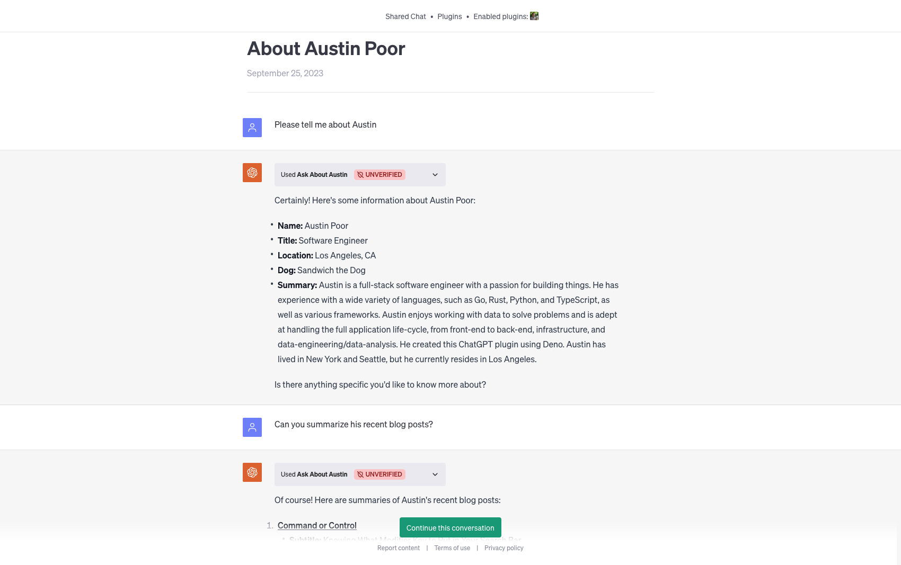

# austin-openai-plugin

_created by Austin Poor_



The code for an OpenAI plugin for getting more information about me, via ChatGPT.

I created this as a fun way to interface with my website, via ChatGPT. It can tell you about me, about my blog posts, about some of my recent projects, and general information that's on my resume.

I'm in the process of attempting to get it verified but if you'd like to try it out yourself, you can run it locally.

## Running Locally

To run the API locally, you'll need to have [Deno](https://deno.com/) installed and then you can run the following command:

```sh
deno run --allow-env=ENV --allow-read=. --allow-net=0.0.0.0:8000 --unstable main.ts
```

For more information on connecting a local plugin to ChatGPT, see the [OpenAI documentation](https://platform.openai.com/docs/plugins/introduction).

### Permission Breakdown

- `--allow-env=ENV`: The `ENV` environment variable is used to check if the app is running in production.
- `--allow-read=.`: Reads the `openapi.yaml` and `static/logo.png` files from the working directory.
- `--allow-net=0.0.0.0:8000`: When running locally, serves the API on `http://localhost:8000`
- `--unstable`: Uses the unstable **Deno KV** API for storing *say hi* requests

